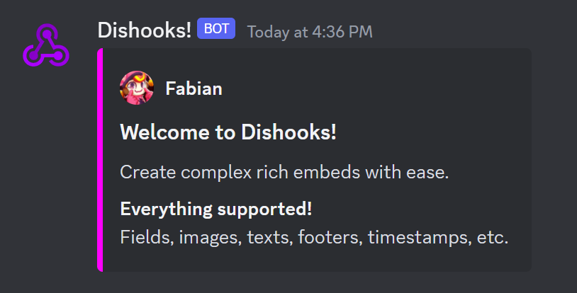

Dishooks is a C# wrapper for the Discord webhook API. It allows you to easily send messages to Discord channels using webhooks from a C# application. It is currently only available on the [Unity Asset Store](https://assetstore.unity.com/packages/tools/network/dishooks-send-discord-messages-from-your-game-171381), but is planned to maybe be released on NuGet in the future.

Dishooks is built with simplicity and OOP in mind, and is very easy to use. It supports full coverage over the API, including embeds, TTS, attachments and customizable avatars and usernames.

<pre style="background-color: #22272e;">
<code class="language-cs">
    // Create a webhook
    Webhook webhook = new Webhook
    {
        URL = Dishook.DefaultUrl,
        Username = "Dishooks!",
        AvatarUrl = "https://i.imgur.com/Ukqoy8s.png"
    };
    
    // Create an embed
    Embed embed = new Embed
    {
        Color = Color.magenta,
        Author = new Author("Fabian", "https://i.imgur.com/k5lNAWS.png"),
        Title = "Welcome to Dishooks!",
        Description = "Create complex rich embeds with ease.",
        Fields = new[]
        {
            new Field("Everything supported!", "Fields, images, texts, footers, timestamps, etc."),
        },
    };
    
    // Attach the embed to the webhook
    webhook.AddEmbed(embed);
    
    // Send the webhook to Discord
    webhook.Send();
</code>
</pre>

## Development timeline

Dishooks started out in mid-2020 as a super simple wrapper using the default System.Net classes, but I quickly realized that it was a bit too simple and lacked many important features. In early 2022 I released the first iteration of embed support, providing full coverage for sending embeds like the one sent above. I learned a lot about OOP and JSON serialization during this time, and I'm very happy with how the embed system turned out.

Time went by, and in mid-2022 I got an email from a software engineer at Unity who was using Dishooks in a project. They required some features that Dishooks did not have at the time, namely support for sending local files as attachments. I looked into it, and it turned out to be a bit more complicated than I thought. I had to learn about HTTP multipart requests, and how to send files using them. Since Dishooks at the time only was able to send text content, namely `application/json`, I had to rewrite the networking code to support sending `multipart/form-data` content.

A few days later, on July 7th, Dishooks 2.1.0 released with full support for sending attachments and using local files in embeds. I was very happy with the result, and I'm still very happy with it today! In December 2022 I started working on an online documentation using docFX, which is live at [https://sofia.kiwi/dishooks/](https://sofia.kiwi/dishooks/).

As of September 2024, Dishooks has been purchased around **200** times, and **8** features, both smaller and larger ones have been added as a result of user requests. It's been a great journey so far where I have learned a lot!